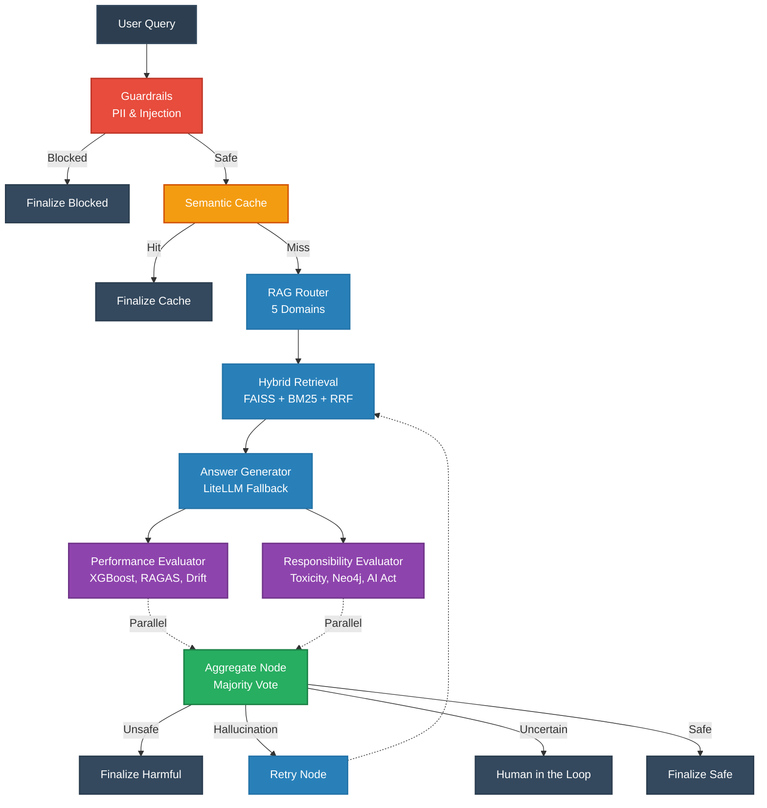

# 🛡️ ControlPlane.ai


**ControlPlane.ai** is an enterprise-grade, real-time AI governance platform. It intercepts every user query through a highly optimized, multi-stage LangGraph pipeline that enforces strict guardrails, semantic caching, agentic RAG retrieval, hallucination detection, and ethical responsibility checks — **all executing in under 10 seconds**.

---

## 🏛️ High-Level Architecture

ControlPlane leverages a highly concurrent LangGraph workflow. The performance and responsibility evaluations run completely in parallel, allowing for deep compliance and hallucination checks without blocking the user experience.



---

## ✨ Core Capabilities

### 1. 🚦 Real-Time Guardrails
- **PII Masking:** Uses `spaCy` to automatically redact sensitive information (emails, phone numbers) before they hit the LLM.
- **Injection Detection:** Flags and blocks prompt injection and jailbreak attempts.

### 2. ⚡ Semantic Caching
- **Fast Hits:** Cosine-similarity caching via MiniLM embeddings. If a query is semantically similar to a recent one, it serves the cached response instantly, saving tokens and time.

### 3. 🧠 Agentic RAG
- **Dynamic Routing:** An LLM router categorizes the query into 1 of 5 distinct knowledge domains (`hr_policy`, `customer_support`, `internal_knowledge`, `toxicity_kb`, `decision_support`).
- **Hybrid Search:** Combines FAISS Vector Search with BM25 Keyword Search, fused via Reciprocal Rank Fusion (RRF) for top-tier document retrieval.

### 4. 📈 Parallel Performance Branch (Hallucination Detection)
Evaluates the generated answer for hallucinations in parallel using three methods:
- **XGBoost Scoring:** A trained ML model predicts hallucination probability.
- **RAGAS Metrics:** Measures faithfulness, answer relevancy, and context coverage.
- **Entity Drift:** Ensures named entities generated in the answer actually exist in the retrieved context.

### 5. ⚖️ Parallel Responsibility Branch (Ethical & Legal Compliance)
Ensures the AI does not produce hate speech, discrimination, or violate laws:
- **Toxicity Ensemble:** Concurrent evaluation across 3 local models (`Detoxify`, `toxic-bert`, `s-nlp roberta`) on both the query and the answer.
- **Compliance Graph:** Queries a Neo4j Knowledge Graph containing the **EU AI Act** and **NIST AI RMF**.
- **Slur & Hate Detection:** Directly intercepts discriminatory logic and cites exact legal articles when generating block reports.

### 6. 🌐 LiteLLM Router (Multi-Provider Resilience)
Never fail on an API outage. The LiteLLM singleton manages multiple `GROQ` and `GEMINI` API keys, gracefully falling back between providers and models to ensure 100% uptime.

---

## 🛠️ Technology Stack

| Category | Technologies Used |
|---|---|
| **Orchestration** | LangGraph, LangChain |
| **LLM Gateway** | LiteLLM, Groq, Gemini |
| **Vector DBs** | FAISS, ChromaDB |
| **Graph DB** | Neo4j Aura |
| **Retrieval** | BM25, MiniLM, RRF |
| **Frontend** | Streamlit |
| **Machine Learning** | XGBoost, HuggingFace (Transformers), spaCy |

---

## 🚀 Getting Started

Follow these instructions to spin up the entire platform locally.

### Prerequisites
- Python 3.10
- API Keys for Groq and Gemini
- A Neo4j Aura Database instance (Free tier works)
- Optional: LangSmith API key for tracing

### 1. Clone & Setup Environment
```bash
git clone https://github.com/Bhavesh-Verma-git/To-be-Winners-2026-AIC.git
cd To-be-Winners-2026-AIC

# Create a virtual environment
python -3.10 -m venv .venv

# Activate it (Windows PowerShell)
.\.venv\Scripts\Activate.ps1
# Mac/Linux: source .venv/bin/activate
```

### 2. Install Dependencies
```bash
pip install -r controlplane/requirements.txt
python -m spacy download en_core_web_sm
```

### 3. Configure Credentials
```bash
cp controlplane/.env.example controlplane/.env
```
Edit `controlplane/.env` with your specific keys:
```env
GROQ_API_KEYS="gsk_your_groq_key1,gsk_your_groq_key2"
GEMINI_API_KEYS="your_gemini_key"
NEO4J_URI="neo4j+s://your-instance.databases.neo4j.io"
NEO4J_USERNAME="neo4j"
NEO4J_PASSWORD="your-password"
```

### 4. Build Indices & Warmup
Pre-compute the hybrid search indices and download local ML models to ensure the <10s runtime requirement:
```bash
python -m controlplane.scripts.build_hr_bm25
python -m controlplane.scripts.build_responsibility_index
python -m controlplane.scripts.warmup
```

### 5. Launch the Platform
```bash
streamlit run controlplane/app/streamlit_app.py
```
The application will be available at `http://localhost:8501`. 

---

## 📊 Dashboard & UI Tabs
The Streamlit interface provides a deep dive into the system's inner workings:
1. **Query / Answer:** Submit real-time queries and view finalized, badge-certified responses.
2. **Dashboard:** Live telemetry including node-level latency, token costs, and RAGAS scores.
3. **Live Workflow:** An animated, real-time visual representation of the LangGraph execution path.
4. **Retrieval & Evidence:** Inspect the exact chunks (Vector vs BM25) retrieved and the legal clauses cited during responsibility evaluations.
