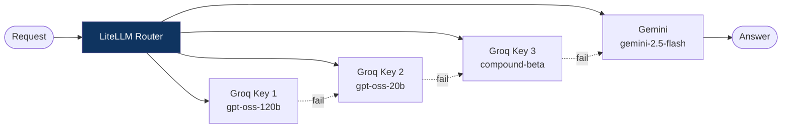

<div align="center">


# ControlPlane.ai

### Enterprise-Grade Real-Time AI Governance Platform

*Intercept. Evaluate. Govern. All in under 10 seconds.*

<br/>

[](https://python.org)
[](https://langchain-ai.github.io/langgraph/)
[](https://docs.litellm.ai/)
[](https://streamlit.io)
[](https://neo4j.com)
[](https://faiss.ai/)

[](LICENSE)
[](https://github.com/Bhavesh-Verma-git/To-be-Winners-2026-AIC)

</div>

---

## 📖 Overview

**ControlPlane.ai** is a production-ready AI governance middleware that sits between your users and your LLM. Every single query passes through a rigorous, multi-stage pipeline that ensures responses are:

- ✅ **Safe** — Free from PII, prompt injections, and jailbreaks
- ✅ **Accurate** — Hallucination-free, verified by 3 independent evaluators  
- ✅ **Compliant** — Aligned with the EU AI Act, NIST AI RMF, and corporate ethics policies
- ✅ **Fast** — The full governance cycle completes in **< 10 seconds**

---

## 🏛️ System Architecture

The pipeline is a **directed acyclic graph** built on LangGraph. The Performance and Responsibility branches run **completely in parallel**, enabling deep multi-dimensional evaluation without sacrificing latency.

```mermaid
flowchart TD
    A([👤 User Query]) --> B

    subgraph GUARD ["🚦  Guardrails Layer"]
        B[PII Masking\nspaCy NER] --> C{Injection\nDetected?}
    end

    C -- ❌ Blocked --> Z1([🔴 Finalize Block])
    C -- ✅ Safe --> D

    subgraph CACHE ["⚡  Semantic Cache"]
        D{Cosine Similarity\n≥ threshold?}
    end

    D -- ✅ Hit --> Z2([⚡ Finalize Cache])
    D -- ❌ Miss --> E

    subgraph RAG ["🧠  Agentic RAG Core"]
        E[LLM Router\nClassify Domain] --> F[Hybrid Retrieval\nFAISS + BM25 → RRF]
        F --> G[Answer Generator\nLiteLLM Failover]
    end

    G --> H & I

    subgraph PARALLEL ["⚖️  Parallel Evaluation  ⚡"]
        subgraph PERF ["📈 Performance Branch"]
            H[XGBoost Hallucination\nRagas Faithfulness\nEntity Drift]
        end
        subgraph RESP ["🛡️ Responsibility Branch"]
            I[Toxicity Ensemble\nNeo4j Compliance Graph\nEU AI Act Check]
        end
    end

    H & I --> J

    subgraph AGG ["🎯  Aggregate & Decide"]
        J{Majority Vote\nDecision Engine}
    end

    J -- 🔴 Unsafe --> Z3([🔴 Finalize Harmful\nFull Compliance Report])
    J -- 🔄 Hallucinated --> G
    J -- 🤔 Uncertain --> Z4([🤔 Human-in-the-Loop])
    J -- 🟢 Clear --> Z5([🟢 Finalize Safe\nCache Write-back])

    style PARALLEL fill:#1a1a2e,stroke:#4a4a8a,stroke-width:2px
    style PERF fill:#16213e,stroke:#0f3460,stroke-width:1px
    style RESP fill:#16213e,stroke:#0f3460,stroke-width:1px
    style RAG fill:#0d1b2a,stroke:#1b4332,stroke-width:1px
    style GUARD fill:#0d1b2a,stroke:#7b2d00,stroke-width:1px
    style CACHE fill:#0d1b2a,stroke:#7b5e00,stroke-width:1px
    style AGG fill:#0d1b2a,stroke:#4a4a8a,stroke-width:1px
```



---

## 🗂️ Project Structure

```
📦 Accenture2.0/
├── 📁 controlplane/               ← Main governance package
│   ├── 📁 app/                    ← Streamlit UI (4 tabs)
│   │   ├── streamlit_app.py       ← Entry point
│   │   ├── tab_dashboard.py       ← Latency & cost telemetry
│   │   ├── tab_workflow.py        ← Live LangGraph visualizer
│   │   └── tab_evidence.py        ← Retrieved chunks & legal citations
│   ├── 📁 graph/nodes/            ← All LangGraph pipeline nodes
│   │   ├── guardrails.py          ← PII + injection check
│   │   ├── semantic_cache.py      ← Cosine similarity cache
│   │   ├── rag_router.py          ← Domain classifier
│   │   ├── retrieval.py           ← Hybrid retriever (RRF)
│   │   ├── answer_generator.py    ← LLM streaming answer
│   │   ├── performance.py         ← XGBoost + RAGAS + Drift
│   │   ├── responsibility.py      ← Toxicity + Neo4j + EU AI Act
│   │   ├── aggregate.py           ← Majority vote decision
│   │   └── finalize.py            ← 4 terminal outcome nodes
│   ├── 📁 llm/                    ← LiteLLM multi-provider router
│   ├── 📁 retrievers/             ← Per-KB hybrid retriever classes
│   ├── 📁 responsibility/         ← Toxicity, Neo4j, evaluator logic
│   ├── 📁 performance/            ← XGBoost, RAGAS, entity drift
│   ├── 📁 guardrails/             ← PII masker + injection detector
│   ├── 📁 cache/                  ← Semantic cache engine
│   ├── 📁 scripts/                ← One-time index builders & warmup
│   ├── config.py                  ← All settings, thresholds, model catalog
│   └── state.py                   ← ControlPlaneState TypedDict schema
│
├── 📁 rag_agents/                 ← Domain knowledge bases & FAISS indices
│   ├── hr_policy/                 ← HR policy PDFs + FAISS + BM25
│   ├── customer_support/          ← Customer support Q&A
│   ├── internal_knowledge/        ← Azure / internal tech docs
│   ├── Toxic_RAG/                 ← Toxicity & hate-speech examples
│   └── Decision Support Rag/      ← Strategic decision knowledge base
│
├── 📁 master_router/              ← Legacy standalone router (prototype)
├── 📁 Responsiblity Agent/        ← Standalone responsibility agent code
├── .gitignore
└── README.md
```

---

## ✨ Core Features Deep Dive

<table>
<tr>
<td width="50%">

### 🚦 Guardrails Layer
Protects the pipeline at the very front.
- **PII Detection** via `spaCy` NER — masks emails, phone numbers, IDs
- **Prompt Injection** — regex + semantic similarity against known jailbreak patterns
- Blocked queries are finalized with a descriptive reason — never silently dropped

</td>
<td width="50%">

### ⚡ Semantic Cache
Delivers instant responses for repeated queries.
- **MiniLM Embeddings** compute cosine similarity against cached Q&A pairs
- Configurable threshold via `CP_CACHE_THRESHOLD` env var
- Cache write-back only occurs on clean, non-retried, safe answers

</td>
</tr>
<tr>
<td width="50%">

### 🧠 Agentic RAG Router
Intelligently directs every query to the right knowledge domain.

| Route | Knowledge Base |
|---|---|
| `hr_policy` | HR policies & procedures |
| `customer_support` | Customer Q&A |
| `internal_knowledge` | Azure / internal docs |
| `toxicity_kb` | Content safety examples |
| `decision_support` | Strategic frameworks |

</td>
<td width="50%">

### 🔍 Hybrid Retrieval (RRF Fusion)
Combines the best of both retrieval paradigms.
- **FAISS** (semantic vector search) + **BM25** (keyword search)
- **Reciprocal Rank Fusion** merges both ranked lists for optimal top-k
- Configurable `k` via `CP_VECTOR_K`, `CP_BM25_K`, `CP_RRF_K` env vars

</td>
</tr>
<tr>
<td width="50%">

### 📈 Performance Branch
Three independent hallucination detectors run in parallel:
- **XGBoost** — trained classifier scores hallucination probability
- **RAGAS** — faithfulness, answer relevancy, context coverage
- **Entity Drift** — named entity overlap between context and answer
- Majority vote triggers a **retry** with a rewritten query (once)

</td>
<td width="50%">

### ⚖️ Responsibility Branch
Three-layer ethical and legal compliance check:
- **Toxicity Ensemble** — `Detoxify` + `toxic-bert` + `s-nlp roberta` run on both the query and the answer
- **Neo4j Knowledge Graph** — queries compliance rules from EU AI Act & NIST AI RMF
- **Hate-speech Detection** — flags slurs and discriminatory content directly from retrieved chunks
- Generates a **detailed compliance report** citing exact articles when blocking

</td>
</tr>
</table>

---

## ⚡ LiteLLM Multi-Provider Router



The LiteLLM singleton manages a **pool of API keys** across multiple providers. If one key is rate-limited or one provider goes down, it automatically cascades to the next — ensuring zero downtime. Models are organized into 7 categories (`light`, `medium`, `heavy`, `judge`, `main_agent`, `suggestion`, `responsibility`).

---

## 🛠️ Tech Stack

| Layer | Technology | Purpose |
|---|---|---|
| **Orchestration** | LangGraph + LangChain | Stateful agentic pipeline |
| **LLM Gateway** | LiteLLM | Multi-provider failover |
| **LLM Providers** | Groq, Gemini | Primary + fallback inference |
| **Vector Store** | FAISS | Fast ANN semantic search |
| **Graph DB** | Neo4j Aura | Legal compliance knowledge graph |
| **Vector DB** | ChromaDB | Responsibility KB embeddings |
| **Keyword Search** | BM25 | Lexical retrieval |
| **Embeddings** | MiniLM-L6, BGE-small | Semantic similarity |
| **ML Models** | XGBoost | Hallucination classification |
| **Eval Framework** | RAGAS | RAG answer quality metrics |
| **Toxicity** | Detoxify, toxic-bert, s-nlp roberta | 3-model ensemble |
| **NLP** | spaCy | PII entity recognition |
| **NLI** | cross-encoder/nli-distilroberta | Entity drift scoring |
| **UI** | Streamlit | 4-tab governance dashboard |
| **Tracing** | LangSmith | End-to-end observability |

---

## 🚀 Quick Start

### Prerequisites
- Python **3.10**
- Groq API Key → [console.groq.com](https://console.groq.com)
- Gemini API Key → [aistudio.google.com](https://aistudio.google.com)
- Neo4j Aura Free Instance → [neo4j.com/cloud/aura](https://neo4j.com/cloud/aura/)

### Installation

```bash
# 1. Clone the repository
git clone https://github.com/Bhavesh-Verma-git/To-be-Winners-2026-AIC.git
cd To-be-Winners-2026-AIC

# 2. Create and activate a virtual environment
python -m venv .venv
.\.venv\Scripts\Activate.ps1      # Windows
# source .venv/bin/activate       # Mac / Linux

# 3. Install all dependencies
pip install -r controlplane/requirements.txt
python -m spacy download en_core_web_sm
```

### Configuration

```bash
# Copy the template
cp controlplane/.env.example controlplane/.env
```

Open `controlplane/.env` and fill in your keys:

```env
# ── LLM Providers ────────────────────────────────────────────
GROQ_API_KEYS="gsk_key1,gsk_key2,gsk_key3"
GEMINI_API_KEYS="your_gemini_key"

# ── Neo4j Aura ───────────────────────────────────────────────
NEO4J_URI="neo4j+s://xxxxxxxx.databases.neo4j.io"
NEO4J_USERNAME="neo4j"
NEO4J_PASSWORD="your-strong-password"
NEO4J_DATABASE="neo4j"

# ── Observability (optional) ─────────────────────────────────
LANGCHAIN_API_KEY="lsv2_your_langsmith_key"
LANGCHAIN_PROJECT="controlplane"

# ── Tunable Thresholds ───────────────────────────────────────
CP_CACHE_THRESHOLD=0.80
CP_TOX_HARD=0.70
CP_TOX_SOFT=0.40
CP_RAGAS_FAIL=0.50
```

### Build Indices (One-Time Setup)

```bash
# Build BM25 index for HR policy knowledge base
python -m controlplane.scripts.build_hr_bm25

# Build responsibility KB (vector + graph, connects to Neo4j)
python -m controlplane.scripts.build_responsibility_index

# Pre-load all local ML models and run a full graph warm-up pass
python -m controlplane.scripts.warmup
```

### Launch 🚀

```bash
streamlit run controlplane/app/streamlit_app.py
```

> Open **http://localhost:8501** in your browser.

---

## 🖥️ UI Walkthrough

| Tab | What You See |
|---|---|
| **Query / Answer** | Submit queries, view the finalized response with verdict badges (`SAFE`, `HARMFUL`, `CACHE HIT`, `BLOCKED`) |
| **Dashboard** | Real-time latency per node, LLM call cost, token counts, and RAGAS faithfulness scores |
| **Live Workflow** | An animated graph showing the exact execution path taken for the last query |
| **Retrieval & Evidence** | Side-by-side Vector vs BM25 retrieved chunks, RRF scores, and the legal citations used in any compliance report |

---

## 🔐 Security & Compliance

ControlPlane is built around the principle of **governance by design**, not as an afterthought:

- 🔒 **API keys** are never logged or traced — protected via `.gitignore` and `.env`
- 🌍 **EU AI Act Article 5** prohibited practices are actively checked on every response
- 📋 **NIST AI RMF** GOVERN, MAP, MEASURE, and MANAGE functions are embedded into the pipeline
- 🧬 **Human-in-the-Loop** intervention is available for uncertain or ambiguous cases
- 🔁 **Automatic retry** with query reformulation on detected hallucinations

---

## 👥 Team

Built with 💪 by **Team To-Be-Winners** for the **Accenture AI Innovation Challenge 2026**.

---

<div align="center">

**⭐ If this project impressed you, give it a star! ⭐**

[](https://github.com/Bhavesh-Verma-git/To-be-Winners-2026-AIC)

*Built with ❤️ using LangGraph · LiteLLM · Neo4j · Streamlit*

</div>
